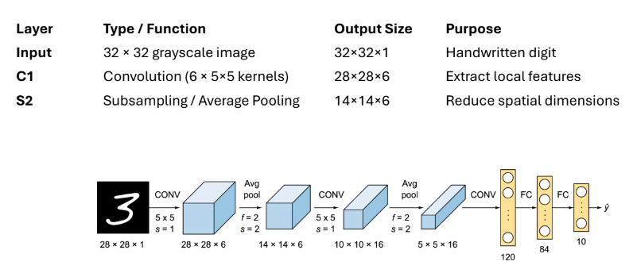

# Lecture 7 Summary: Advanced CNN Architectures

This lecture explores the **evolution** of Convolutional Neural Networks, tracing the history of the 5 most influential architectures. Each new design built upon the last, solving a major problem and pushing the boundaries of what's possible in computer vision.

This journey goes from the "pioneer" (LeNet) to the "breakthrough" (AlexNet) and finally to the "ultra-deep" (ResNet).

---

## 1. LeNet-5 (The Pioneer, 1998)

* **Who:** Yann LeCun.
* **What it did:** The "grandfather" of CNNs. It was the first widely successful application of the core CNN concepts.
* **Task:** Built to recognize handwritten digits (for bank check reading).
* **Key Idea:** It **proved** that a simple, stacked architecture of `[CONV -> POOL -> CONV -> POOL -> FC -> FC]` could successfully learn features automatically.

---

## 2. AlexNet (The Breakthrough, 2012)

* **Who:** Alex Krizhevsky, Ilya Sutskever, & Geoffrey Hinton.
* **What it did:** It **won the 2012 ImageNet (ILSVRC) competition** by a massive margin, kickstarting the modern "deep learning" revolution. It proved that deep CNNs could easily outperform all traditional computer vision methods.
* **Key Innovations:** It was essentially a *bigger, deeper* LeNet that used three crucial new techniques:
    1.  **ReLU Activation:** Used `ReLU` instead of `Tanh`/`Sigmoid`. This was much faster to compute and, most importantly, it solved the "vanishing gradient" problem, allowing the network to be *deep*.
    2.  **Dropout:** Used `Dropout` layers to prevent the massive network from **overfitting**.
    3.  **GPU Training:** It was the first large-scale model trained on **GPUs**, which made training a network this large *feasible* for the first time.

---

## 3. VGGNet (Simplicity and Depth, 2014)

* **Who:** VGG (Visual Geometry Group) at Oxford.
* **What it did:** Proved that **"deeper is better"** by building a network 16-19 layers deep.
* **Key Innovation:** **Extreme Simplicity.** The entire network is built using *only* stacked `3x3` CONV filters and `2x2` POOL layers.
* **Why `3x3`?** The authors showed that stacking two `3x3` CONV layers has the same "receptive field" (sees the same area) as one `5x5` layer, but it has *fewer parameters* and *more non-linearity* (it uses two `ReLU`s instead of one), making it more powerful and efficient.

---

## 4. GoogLeNet / Inception (Efficiency & Multi-Scale, 2015)

* **Who:** Google.
* **What it did:** Won the 2014 ImageNet competition (beating VGG). It focused on being **computationally efficient** while still being very deep (22 layers).
* **Key Innovation 1: The "Inception Module"**
    * **Problem:** What's the "best" filter size to use (a `1x1`? `3x3`? `5x5`?)?
    * **Solution:** "Why choose?" The Inception Module runs *all of them in parallel* (`1x1`, `3x3`, `5x5`, and `MaxPool`) on the same input and **concatenates** their results. This allows the network to capture features at multiple scales simultaneously.
* **Key Innovation 2: The `1x1` Convolution**
    * The Inception Module used `1x1` CONV layers as a **"bottleneck"** to *reduce* the number of channels (depth) *before* the expensive `3x3` and `5x5` convolutions. This dramatically reduced the number of parameters and computation.

---

## 5. ResNet (Solving the Ultra-Deep, 2015)

* **Who:** Kaiming He et al. (Microsoft Research).
* **What it did:** Won the 2015 ImageNet competition. It smashed the "depth barrier," allowing for networks that are **100+ layers deep** (even 1000+) to be trained successfully.
* **The Problem it Solved:** The **Vanishing Gradient Problem** (and a related "degradation" problem).
    * When a network gets *too* deep (e.g., 50+ layers), the gradient signal from the `Loss Function` becomes *too small* by the time it `Backpropagates` to the early layers, and those layers stop learning.
* **Key Innovation: The "Residual Block" (or "Skip Connection")**
    * **How it works:** It creates a "shortcut" that allows the input `x` to *skip* over a few layers and be **added** to their output.
    * **Formula:** `y = F(x) + x` (where `F(x)` is the layers, and `x` is the "skip connection").
    * **Why it works:** This shortcut creates a direct, uninterrupted path for the gradient to flow backward. The network no longer has to learn the *entire* function; it only has to learn the "residual" `F(x)`. This is much easier and allows gradients to flow, solving the vanishing gradient problem.

