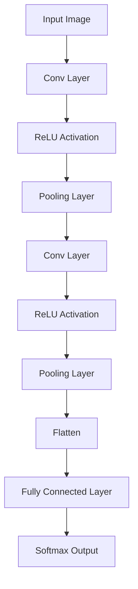

 🧠 Lecture 4: Convolutional Neural Networks (CNN)


---

## 🎯 Learning Outcomes
By the end of this lecture, you should be able to:
- Explain why **fully connected networks** are inefficient for image data.
- Understand the concepts of **local receptive fields** and **weight sharing**.
- Describe how **convolutional filters/kernels** extract spatial features.
- Explain the purpose of **pooling layers** in reducing dimensionality.
- Identify the main components in a **CNN architecture**.
- Implement a basic **CNN model**.

---

## 1) Why Not Use Fully Connected Networks for Images?

A normal neural network (MLP) requires **flattening** the image into a **1D vector**.

Example:  
A **28×28** image → becomes **784 inputs**.  
If the first layer has **100 neurons**:

$$
784 \times 100 = 78{,}400 \text{ weights}
$$

This is only the **first layer** 😱

### Problems:
| Issue | Explanation |
|------|-------------|
| **Too many parameters** | More memory + harder training |
| **Loses spatial structure** | Pixels that were neighbors become separated |

---

## 2) CNN Intuition

Instead of connecting all pixels to all neurons, CNNs learn **filters** that slide across the image and detect **patterns** such as:

- Edges
- Corners
- Textures
- Shapes

```mermaid
graph TD
A[Input Image] --> B[Convolution Layer]
B --> C[Feature Maps]
C --> D[Pooling Layer]
D --> E[Fully Connected Layer]
E --> F[Classification Output]
````

---

## 3) Convolutional Filters (Kernels) & Feature Maps

A **filter (kernel)** is a small matrix (e.g., 3×3 or 5×5) that scans the image.

Each filter extracts a **specific feature**.

Example: Edge Detection Filter

$$
\begin{bmatrix}
-1 & -1 & -1 \
0 & 0 & 0 \
1 & 1 & 1
\end{bmatrix}
$$

The result is a **feature map**, showing where the feature appears in the image.

---

## 4) Receptive Field & Weight Sharing

| Concept             | Meaning                                                    |
| ------------------- | ---------------------------------------------------------- |
| **Receptive Field** | The region of the image the filter observes at one time    |
| **Weight Sharing**  | The same filter weights are applied across the whole image |

This drastically reduces parameters and preserves spatial context.

---

## 5) Convolution Layer Parameters

| Parameter       | Description                                    |
| --------------- | ---------------------------------------------- |
| **Kernel Size** | Dimensions of filter (e.g., 3×3)               |
| **Stride**      | Step size while sliding the filter             |
| **Padding**     | Adds zeros around image edges to preserve size |

```mermaid
graph LR
A[Image] -->|Apply Filters| B[Feature Maps]
B -->|Downsampling| C[Reduced Feature Maps]
```

---

## 6) Pooling Layer

Pooling **reduces dimensions** while keeping important information.

### Max Pooling

Takes the **largest value** from each region.

### Average Pooling

Takes the **average value**.

| Pool Type | Example Output          | Purpose                    |
| --------- | ----------------------- | -------------------------- |
| Max Pool  | Keeps strongest feature | Robust to noise            |
| Avg Pool  | Smooths feature map     | Preserves general patterns |

This makes the model:

* Faster
* Less prone to overfitting
* More generalized

---

## 7) Fully Connected (FC) Layer

After convolution and pooling layers:

* The feature maps are **flattened into a vector**
* Passed into a normal neural network (MLP)
* Resulting in classification output (e.g., softmax)

---

## 8) Full CNN Architecture



---

## 🧱 CNN Building Blocks Summary

| Layer               | Role                            |
| ------------------- | ------------------------------- |
| **Conv Layer**      | Extracts features using filters |
| **ReLU**            | Adds non-linearity              |
| **Pooling**         | Reduces size and computations   |
| **Fully Connected** | Performs classification         |

---

## ✅ Key Advantages of CNNs

| Benefit                | Impact                               |
| ---------------------- | ------------------------------------ |
| Weight Sharing         | Fewer parameters                     |
| Local Receptive Fields | Preserves spatial structure          |
| Hierarchical Learning  | Learns from edges → shapes → objects |

---

## 🧪 Lab (Implementation Idea)

In PyTorch:

```python
import torch.nn as nn

class SimpleCNN(nn.Module):
    def __init__(self):
        super().__init__()
        self.conv = nn.Conv2d(1, 8, kernel_size=3)
        self.pool = nn.MaxPool2d(2, 2)
        self.fc = nn.Linear(8*13*13, 10) # Example for 28x28 input
    def forward(self, x):
        x = self.pool(nn.ReLU()(self.conv(x)))
        x = x.view(x.size(0), -1)
        x = self.fc(x)
        return x
```

---

## 📚 References

* Deep Learning for Vision Systems – Elgendy (2020)
* CNNs for Computer Vision – Khan et al. (2018)
* Deep Learning with Python – Chollet (2018)
