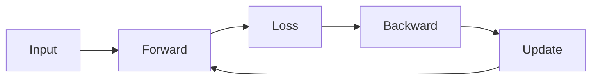

# 🧠 Lecture 3: Loss Functions, Optimization & Neural Network Overview


## 🎯 Learning Outcomes
By the end of this lecture, you should be able to:
- Explain what a **Loss Function** is and why it is needed.
- Compare common **Regression** and **Classification** loss functions.
- Understand **Gradient Descent** and when to use Batch, Stochastic, or Mini-batch training.
- Describe the structure and role of **Neurons**, **Activation Functions**, and **Feed-Forward Neural Networks**.
- Understand how **Backpropagation** updates weights during training.

---

## 1) What is a Loss Function?

A **Loss Function** measures how **wrong** the model is.  
It compares:
- The model's prediction $\( \hat{y} \)$
- The true label \( y \)

$$\[
Loss = Error(y, \hat{y})
\]$$

| Low Loss | High Loss |
|---------|----------|
| Model predicts correctly with high confidence | Model predicts incorrectly or hesitates |

---

## 2) Loss in Regression (Predicting Numbers)

### **a) Mean Absolute Error (MAE)**  
$$\[
MAE = |y - \hat{y}|
\]$$
- Measures the average absolute difference.
- Robust to outliers.

### **b) Mean Squared Error (MSE)**  
$$\[
MSE = (y - \hat{y})^2
\]$$
- Penalizes large errors more.
- Useful when large mistakes are critical.

### **c) Huber Loss**  
Behaves like MSE for small errors and MAE for large errors.
- Best for noisy datasets.

---

## 3) Loss in Classification (Predicting Classes)

### **a) Cross-Entropy Loss**
Used when predicting **probabilities**.

$$\[
Loss = -\log(\hat{y}_{true})
\]$$

| $\(\hat{y}\)$ (Predicted Probability) | Loss | Meaning |
|---|---|---|
| **0.99** | ~0 | Confident & correct ✅ |
| **0.50** | ~0.69 | Uncertain 😐 |
| **0.10** | ~2.30 | Confident but wrong ❌ |

---

### **b) Hinge Loss (Used in SVMs)**  
$$\[
Loss = \max(0, 1 - y \cdot f(x))
\]$$

Encourages not just correct classification, but **correct with margin**.

---

## 4) Loss in Image Segmentation (Example in CV)

### Dice Loss  
Measures overlap between predicted mask \(P\) and ground truth mask \(G\).

$$\[
Dice = \frac{2 \cdot (P \cap G)}{P + G}
\]$$
$$\[
Dice\:Loss = 1 - Dice
\]$$

Higher Dice → Better segmentation.

---

## 5) Optimization — Minimizing the Loss

We use **Gradient Descent** to adjust model weights and reduce Loss.

$$\[
W := W - \eta \cdot \frac{\partial L}{\partial W}
\]$$

Where:
- $\( W \)$ = weights
- $\( \eta \)$ = learning rate

---

### Gradient Descent Variants

| Method | Description | Pros | Cons |
|--------|-------------|------|------|
| **Batch GD** | Uses whole dataset to update | Stable | Slow |
| **Stochastic GD (SGD)** | Updates using 1 sample at a time | Fast | Noisy updates |
| **Mini-Batch GD** | Updates using small batches | Fast + Stable ✅ | Most used |

---

### Optimizer Improvements

| Optimizer | Idea |
|----------|------|
| **Momentum** | Adds velocity to updates (smooths jumps) |
| **RMSProp** | Adjusts learning rate per weight |
| **Adam** | Combines Momentum + RMSProp (default choice) |

---

## 6) Neuron Model

A neuron performs:
$$\[
s = W \cdot x + b
\]$$
then applies **an activation function**.

```mermaid
graph LR
X[Inputs x1, x2, ..., xn] --> S[Weighted Sum: W*x + b]
S --> A[Activation Function]
A --> Output
````

---

## 7) Activation Functions

| Function    | Formula                                 | Use                             |
| ----------- | --------------------------------------- | ------------------------------- |
| **ReLU**    | $(f(z)=\max(0,z))$                        | Fast, used in deep networks     |
| **Sigmoid** | $(f(z)=\frac{1}{1+e^{-z}})$               | Binary classification           |
| **Tanh**    | $(f(z)=tanh(z))$                          | Balanced output -1 to 1         |
| **Softmax** | $(f(z_i)=\frac{e^{z_i}}{\sum_j e^{z_j}})$ | Converts logits → probabilities |

---

## 8) Feed-Forward Neural Network

```mermaid
graph TD
A[Input Layer] --> B[Hidden Layer 1]
B --> C[Hidden Layer 2]
C --> D[Output Layer]
```

* Data flows **forward only** (no loops).
* Each layer transforms the data into more meaningful representation.

---

## 9) Backpropagation (How Neural Networks Learn)

1. **Forward Pass:** Compute output
2. **Compute Loss:** Compare with true label
3. **Backward Pass:** Compute gradients
4. **Update Weights:** Using Gradient Descent
5. Repeat thousands of times → model improves



---

## ✅ Summary

| Topic                | Key Idea                          |
| -------------------- | --------------------------------- |
| Loss Function        | Measures model error              |
| Gradient Descent     | Reduces error iteratively         |
| Activation Functions | Enable non-linear decision making |
| Neural Networks      | Layers of connected neurons       |
| Backpropagation      | Adjusts weights to reduce loss    |

---

## 📚 References

Forsyth, D., & Ponce, J. (2010). *Computer Vision: A Modern Approach.* Pearson Education.

