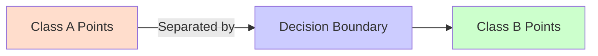

# 🧠 Lecture 2: Image Classification & Linear Models
**Course:** CIS 6217 – Computer Vision for Data Representation  
**Instructor:** Areej Alasiry  
**Institution:** College of Computer Science, King Khalid University  

---

## 🎯 Learning Outcomes
By the end of this lecture, you should be able to:
- Explain the **data-driven approach** in computer vision.
- Implement **basic image classifiers** (KNN and Linear Classifiers).
- Understand the **limitations** of these models compared to deep learning.
- Build intuition about **loss functions** and **decision boundaries**.

---

## 🖼️ What is Image Classification?

> **Goal:** Assign a label `y` to an input image `x`.

Examples:
- Recognizing handwritten digits (MNIST)
- Identifying objects (CIFAR-10, ImageNet)

**Basic process:**

```mermaid
graph LR
A[Input Image] --> B[Feature Extraction]
B --> C[Classifier]
C --> D[Output Label]
````

> The model learns to map image features to class labels.

---

## 🧠 The Data-Driven Approach

Traditional computer vision relied on **handcrafted features** such as:

* **SIFT (Scale-Invariant Feature Transform)**
* **HoG (Histogram of Oriented Gradients)**

Modern *data-driven* vision:

* Learns **both** features and classifiers directly from data.
* Requires **large labeled datasets** and **computational power** (e.g., GPUs).

| Approach       | Feature Source    | Example            |
| -------------- | ----------------- | ------------------ |
| Traditional CV | Handcrafted       | SIFT, HoG          |
| Data-driven CV | Learned from data | CNNs, Transformers |

> 💡 This shift paved the way for modern deep learning models.

---

## 👥 Nearest Neighbor Classifier (KNN)

**K-Nearest Neighbor (KNN)** is one of the simplest supervised machine learning algorithms for classification.

### 🧩 How it Works

1. Store all training samples and their labels.
2. When a new image arrives:

   * Compute its **distance** to every training sample.
   * Find the **K nearest samples**.
   * Predict the **majority label** among them.

```mermaid
graph TD
A[Input Image] --> B[Compute Distance to All Samples]
B --> C[Find K Nearest Neighbors]
C --> D[Majority Voting]
D --> E[Predicted Label]
```

> KNN makes predictions based on similarity — not on learned parameters.

---

## 📏 Distance Metrics

The choice of **distance metric** determines how “closeness” is measured between images.

| Metric             | Formula                                               | Description                        |   |                             |
| ------------------ | ----------------------------------------------------- | ---------------------------------- | - | --------------------------- |
| **L1 (Manhattan)** | ( d_1(I_1, I_2) = \sum_p                              | I_{1p} - I_{2p}                    | ) | Sum of absolute differences |
| **L2 (Euclidean)** | ( d_2(I_1, I_2) = \sqrt{\sum_p (I_{1p} - I_{2p})^2} ) | Square root of squared differences |   |                             |

> 🔍 L2 (Euclidean) is the most common in image-based KNN.

---

## ✅ Strengths & Weaknesses of KNN

| Strengths                           | Weaknesses                            |
| ----------------------------------- | ------------------------------------- |
| Easy to implement and understand    | High memory usage (stores all data)   |
| No training phase                   | Slow for large datasets               |
| Works well for low-dimensional data | Poor generalization to unseen samples |

> ⚠️ KNN is powerful for small problems, but impractical for big datasets like ImageNet.

---

## 📈 Linear Classification

**Linear classifiers** separate classes using a straight line (2D) or **hyperplane** (higher dimensions).

### Mathematical Form:

[
f(x; W, b) = W^T x + b
]

Where:

* **x** → input features
* **W** → weights (defines orientation of the hyperplane)
* **b** → bias (defines offset)

```mermaid
graph TD
A[Feature Vector x] --> B[Compute Weighted Sum: Wx + b]
B --> C[Decision: f(x) > 0 or f(x) < 0]
C --> D[Predicted Class]
```

> The classifier learns **W** and **b** to best separate the data points.

---

## 🧭 Decision Boundaries

* In **2D**, the decision boundary is a **line** separating two classes.
* In **3D**, it’s a **plane**.
* In higher dimensions, it becomes a **hyperplane**.



> Linear boundaries fail when data is **non-linearly separable** (e.g., XOR problem).

---

## 🔄 Gradient Descent – Learning the Weights

Gradient Descent is an optimization algorithm to find the best parameters (W, b).

### Steps:

1. Start with random weights and bias.
2. Compute **predictions** and **loss** (error).
3. Update W and b to **reduce the loss**.
4. Repeat until convergence.

### Intuition

* **Loss function:** measures how wrong the model is.
* **Gradient:** shows the direction to minimize the loss.

> The smaller the loss → the better the classifier.

---

## ⚖️ KNN vs Linear Models

| Feature                | KNN                    | Linear Models          |
| ---------------------- | ---------------------- | ---------------------- |
| **Training**           | No explicit training   | Requires learning W, b |
| **Memory Usage**       | High (stores all data) | Low                    |
| **Speed (Prediction)** | Slow for large data    | Very fast              |
| **Generalization**     | Poor                   | Good                   |
| **Scalability**        | Low                    | High                   |

> Linear models are the foundation for **neural networks**, where layers of linear operations are stacked with nonlinear activations.

---

## 🚧 Limitations of Basic Models

| Model                 | Limitation                                                  |
| --------------------- | ----------------------------------------------------------- |
| **KNN**               | Fails in high-dimensional data (“curse of dimensionality”). |
| **Linear Classifier** | Can’t model nonlinear decision boundaries.                  |
| **Both**              | Lack feature learning; depend on input representation.      |

➡️ These challenges motivate **deep learning models** that can learn complex, nonlinear representations.

---

## 💻 Hands-on Activity

Try the following:

1. Implement **KNN** on CIFAR-10 using NumPy.
2. Train a **Logistic Regression (Linear Classifier)** using SGD.
3. Visualize **decision boundaries** on simple 2D data.
4. Compare accuracy and performance.

---

## 🐍 Python Example

```python
from sklearn.datasets import load_digits
from sklearn.model_selection import train_test_split
from sklearn.neighbors import KNeighborsClassifier
from sklearn.metrics import accuracy_score

# Load data
X, y = load_digits(return_X_y=True)
X_train, X_test, y_train, y_test = train_test_split(X, y, test_size=0.2, random_state=42)

# Initialize KNN classifier
knn = KNeighborsClassifier(n_neighbors=3)
knn.fit(X_train, y_train)

# Evaluate
y_pred = knn.predict(X_test)
print("Accuracy:", accuracy_score(y_test, y_pred))
```

> 🧩 Experiment with different **K values (e.g., 1, 3, 5)** and see how it affects accuracy.

---

## 🧮 Common Loss Functions

| Loss Function     | Used In                           | Formula                       | Description                                                  |
| ----------------- | --------------------------------- | ----------------------------- | ------------------------------------------------------------ |
| **Hinge Loss**    | SVMs                              | ( \max(0, 1 - y \cdot f(x)) ) | Encourages correct classification margin                     |
| **Cross-Entropy** | Logistic Regression / Neural Nets | (-\sum y \log(\hat{y}))       | Measures difference between predicted and true probabilities |

> Loss functions are the **guides** that shape how models learn.

---

## 📚 Summary

| Concept                  | Key Point                                                              |
| ------------------------ | ---------------------------------------------------------------------- |
| **Image Classification** | Assign labels to images                                                |
| **KNN**                  | Simple, interpretable, but not scalable                                |
| **Linear Models**        | Efficient, generalize better, but limited by linearity                 |
| **Loss Functions**       | Quantify model performance and guide optimization                      |
| **Next Step**            | Move toward **Neural Networks** for non-linear representation learning |

---

## 📖 References

* Forsyth, D., & Ponce, J. (2010). *Computer Vision: A Modern Approach.* Pearson Education.
* Bir, P. (2019). *Image Classification with K-Nearest Neighbours.* Medium.

---

## ✅ Summary Checklist

| You Should Be Able To…                                        | ✓ |
| ------------------------------------------------------------- | - |
| Define what image classification is                           | ✅ |
| Explain the difference between traditional and data-driven CV | ✅ |
| Implement KNN and understand its pros/cons                    | ✅ |
| Describe linear classifiers and decision boundaries           | ✅ |
| Understand gradient descent and loss functions                | ✅ |
| Compare KNN vs Linear Models                                  | ✅ |

---

> 🎯 “From pixels to predictions — image classification marks the start of teaching machines to see intelligently.”

Would you like me to now create a **bilingual English–Arabic version** in the same structure as Lecture 1?
```
